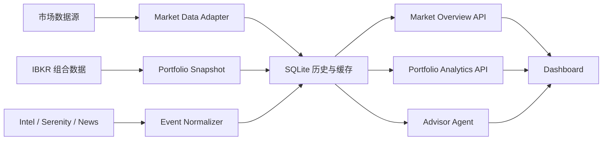

# TradeMind Dashboard 市场驾驶舱设计方案

> 日期：2026-06-12  
> 状态：设计阶段，尚未开始功能实现  
> 目标：在保留 TradeMind 深色金融终端风格的基础上，通过真实市场数据、组合对照、Agent 证据链和克制动效，提高 Dashboard 的信息密度与决策效率。

## 1. 产品目标

Dashboard 应在 10 秒内回答五个问题：

1. 市场今天处于风险偏好、中性还是避险状态？
2. 当前组合相对 SPY、QQQ 和半导体板块表现如何？
3. 组合最大的方向、波动率和集中度风险是什么？
4. 哪些新闻、财报、宏观事件或 Serenity 信号正在影响持仓？
5. Agent 建议用户关注什么，建议依据和失效条件是什么？

Agent 只能提出建议、整理证据和建立提醒，不得自动下单或改变仓位。

## 2. 推荐方案

采用“市场总览 + 组合驾驶舱”双模式，并保留单页快速扫描能力。

- **市场总览**：指数、波动率、利率、美元、行业强弱、市场广度与事件。
- **组合驾驶舱**：组合净值、基准比较、持仓贡献、行业集中度、Greeks 趋势与 Agent 建议。
- **统一状态栏**：两个模式共享交易时段、行情更新时间、数据新鲜度和异常状态。

不采用纯 Bloomberg 式无限堆叠，因为会降低普通屏幕和移动端的可读性；也不采用 Agent 居中的单一叙事，因为用户仍需直接观察底层数据。

## 3. 信息架构

### 3.1 顶部市场状态栏

固定展示：

- SPY、QQQ、SMH
- VIX
- 美国 10 年期国债收益率
- 美元指数 DXY
- 盘前、交易中、盘后或休市状态
- 最后更新时间
- 数据状态：实时、延迟、缓存或不可用

只在数值发生变化时使用短促的涨跌颜色反馈，不持续闪烁。

### 3.2 第一屏：市场状态

左侧约 65% 为标准化市场走势比较图：

- SPY、QQQ、SMH 归一化涨跌幅
- `1D / 5D / 1M / 3M` 时间切换
- 可叠加组合净值曲线
- 联动十字线和统一 Tooltip
- 标记财报、宏观事件、Intel 信号和 Agent 风险提示

右侧约 35% 为市场环境矩阵：

- 风险偏好
- 趋势强度
- 波动率环境
- 科技股相对强弱
- 利率压力
- 市场广度
- Agent 综合置信度

采用紧凑横向刻度、状态文本和小型趋势线，不采用占空间较大的圆形仪表盘。

### 3.3 第二屏：组合分析

包含四个主要模块：

1. **组合净值与基准**：组合、SPY、QQQ 的累计收益与回撤比较。
2. **风险敞口**：行业分布、单一标的集中度、净敞口和总敞口。
3. **Greeks 趋势**：Delta、Gamma、Vega、Theta 当前值及 7/30 日变化。
4. **盈亏归因**：按标的、行业和资产类型展示贡献度排行榜。

当前值和历史趋势必须同时出现，避免只有静态数字而缺少方向信息。

### 3.4 第三屏：事件与 Agent

左侧为统一事件时间线：

- 宏观数据与央行事件
- 持仓相关财报
- Serenity 帖子和关联 ticker
- 新闻 Agent 信号
- 组合异常波动和风险阈值触发

右侧沿用并增强建议中心，每条建议展示：

- 建议内容和优先级
- 相关 ticker
- 触发原因
- 引用数据和来源时间
- 风险条件与失效条件
- Agent 分工和证据链
- 置信度
- 建立 Thesis、加入观察、稍后提醒、忽略

## 4. 数据与系统架构

### 4.1 数据保存原则

- 分钟或定时市场快照入库，不能只保存在浏览器状态中。
- 日线历史行情长期保存，避免重复请求外部数据源。
- 每个行情值记录 `source`、`as_of`、`fetched_at` 和 `freshness`。
- Agent 建议保存其读取的数据版本和证据引用，保证可审计。
- 外部行情失败时使用最后成功缓存，同时明确显示数据年龄。
- 不以 `0`、空数组或虚构值伪装正常结果。

### 4.2 建议新增的数据契约

- `MarketTickerSnapshot`：最新价、涨跌幅、成交时间、来源和新鲜度。
- `MarketSeriesPoint`：时间、标准化收益、原始收盘价和事件标记。
- `MarketRegime`：趋势、波动率、广度、利率压力和综合状态。
- `PortfolioBenchmarkPoint`：组合净值及基准净值。
- `RiskHistoryPoint`：Greeks、净敞口、集中度和回撤。
- `DashboardEvent`：事件类型、时间、ticker、影响程度和来源。

## 5. 工具运用方案

### 5.1 设计与实现方法

| 工具 / Skill | 用途 | 使用边界 |
|---|---|---|
| `frontend-design` | 延续 Terminal Instrument 视觉语言，设计高密度布局、排版、颜色层级与交互状态 | 不引入营销页式大标题、装饰卡片或无业务意义视觉效果 |
| `superpowers:brainstorming` | 在实施前确认信息架构、成功标准和范围 | 设计确认前不进入功能开发 |
| `superpowers:writing-plans` | 把本方案拆成可执行、可测试的任务 | 每个任务给出文件、测试和验收命令 |
| `superpowers:test-driven-development` | 先为数据转换、市场状态评分和 API 契约写失败测试 | 图表视觉细节以浏览器验收补充，不用脆弱的像素级单元测试替代业务测试 |
| `superpowers:verification-before-completion` | 完成前执行全量测试、构建、浏览器检查与数据降级验证 | 没有验证证据时不宣称完成 |

### 5.2 前端技术

| 工具 | 计划用途 | 选择原因 |
|---|---|---|
| React 19 / Next.js | 页面、状态与 API 路由 | 复用现有技术栈 |
| Recharts | 折线图、面积图、柱状图、基准比较和 Greeks 趋势 | 项目已安装，迁移成本低，足够支持本阶段图表 |
| Motion | KPI 数字切换、面板进入、模式切换和建议卡状态变化 | React 集成自然，适合克制的应用级动画 |
| Tailwind CSS v4 | 响应式布局、状态样式和设计 token | 与当前 Dashboard 一致 |
| Lucide Icons | 刷新、信息、告警、展开和时间等操作图标 | 保持按钮语义清晰，避免自绘图标 |

首阶段不引入 GSAP。只有 Showcase 或复杂 Agent 流程演示确实需要时间轴编排时才单独使用，避免主 Dashboard 增加不必要的体积和维护成本。

### 5.3 市场数据与存储

| 工具 | 计划用途 | 策略 |
|---|---|---|
| 现有 IBKR 脚本 | 组合、持仓、期权与可获得的实时行情 | 继续作为组合事实来源，失败时使用已有 stale cache |
| Yahoo Chart 数据接口 / 现有行情脚本 | 指数和标的历史日线 | 主要用于历史图表与基准比较，不声称为交易所实时数据 |
| SQLite | 市场快照、历史序列、事件、Agent 证据版本 | 延续现有数据库，不在本阶段新增独立数据库服务 |
| Next.js Route Handlers | 聚合 Market Overview 与 Portfolio Analytics | 浏览器不直接访问第三方行情源，集中处理缓存和错误 |
| 定时 Agent Loop | 盘前、盘中和收盘后写入快照 | 与现有 loops 模式保持一致，任务可重复运行且避免重复记录 |

若未来需要更可靠的分钟级实时数据，再评估 Polygon、Finnhub 或正式市场数据订阅。本阶段不把付费数据服务设为完成前提。

### 5.4 Agent 工具协作

Agent 工具链建议按以下顺序协作：

1. Research Agent 读取市场状态、基准趋势和事件。
2. Risk Agent 读取组合敞口、Greeks、集中度和回撤。
3. Serenity Lens / Intel Agent 提供相关帖子、新闻和历史反应。
4. Advisor Agent 聚合证据，形成建议、置信度和失效条件。
5. Guardrail 检查数据是否过期或关键证据缺失。
6. Dashboard 只呈现建议和可审计证据，不提供自动执行入口。

新增工具输出必须是结构化 JSON，避免 Agent 从页面文本或图表像素中反向猜测数值。

### 5.5 浏览器与视觉验收工具

| 工具 | 验收内容 |
|---|---|
| Codex in-app Browser | 打开 localhost，验证真实页面、交互、Tooltip、切换和错误状态 |
| Playwright / 浏览器截图 | 桌面、笔记本和移动端固定视口截图回归 |
| 浏览器 Performance 面板 | 检查首屏加载、图表重绘、动画掉帧和布局抖动 |
| Lighthouse / axe | 检查可访问性、颜色对比、按钮名称与 reduced motion |
| TypeScript / ESLint / Next build | 类型、静态检查和生产构建 |
| Python pytest / Node test | 数据层、Agent 和前端纯函数回归 |

## 6. 动画规范

- 首次加载：核心区域分组进入，持续 300–500ms。
- KPI 更新：旧值到新值平滑过渡，容器宽度固定，禁止数字变化造成布局移动。
- 行情变化：绿色或红色背景闪现一次后回到正常状态。
- 图表：首次加载绘制曲线；时间范围切换采用短暂插值。
- 建议卡：按优先级依次出现，交互动作后只更新目标卡片。
- 风险状态：正常、关注、警告之间平滑切换颜色和刻度位置。
- 所有非必要动画遵循 `prefers-reduced-motion`。
- 不使用持续漂浮、无限旋转、大面积光晕或影响读取速度的动画。

## 7. 响应式设计

- **宽屏桌面**：市场图表与环境矩阵并排，事件和 Agent 建议双列。
- **普通笔记本**：降低单行 KPI 数量，次要指标进入可展开区域。
- **平板**：图表全宽，矩阵改为两列，事件与建议纵向排列。
- **移动端**：保留状态栏、市场主图、最高优先级风险和前三条建议；复杂表格改为横向滚动或紧凑列表。

任何断点下都不得出现文字溢出、图表高度跳变、按钮遮挡或卡片内再套卡片。

## 8. 实施阶段

### 阶段一：信息架构与组件边界

- 拆分当前 Dashboard 大页面。
- 建立双模式导航和统一状态栏。
- 定义市场、组合、事件和 Agent 的 TypeScript 数据契约。

### 阶段二：市场数据层

- 建立市场数据 adapter、SQLite 表和缓存策略。
- 新增 Market Overview API。
- 实现新鲜度、缓存和错误降级。

### 阶段三：核心图表

- 市场走势比较图。
- 组合净值与基准图。
- 行业敞口和集中度图。
- Greeks 历史趋势和盈亏归因。

### 阶段四：事件与 Agent 打通

- 统一事件时间线。
- 将 Market Regime、风险历史和事件提供给 Advisor。
- 建议卡展示数据来源、时间、失效条件和 Guardrail 状态。

### 阶段五：动效与响应式

- 引入 Motion 并建立统一 motion token。
- 完成数据变化、模式切换、建议状态和 reduced-motion 处理。
- 完成桌面、平板和移动端布局。

### 阶段六：验收、文档与发布

- 执行测试、类型检查、lint 和生产构建。
- 使用浏览器验证真实数据、缓存数据和失败状态。
- 更新 README、代码树、Agent 架构图和 `WORKLOG.md`。
- 更新 Dashboard 演示截图与视频。

## 9. 验收标准

- 用户在第一屏可识别市场状态、组合方向和最高优先级风险。
- 市场图表至少支持 SPY、QQQ、SMH 与组合净值比较。
- 所有行情都显示来源时间和新鲜度。
- 市场数据失败不会导致 Dashboard 白屏或显示虚假零值。
- Agent 建议可以追溯到具体市场、组合或 Intel 数据。
- Agent 无法自动执行交易。
- 桌面和移动端均无重叠、溢出和明显布局抖动。
- 动画不妨碍快速读取，并完整支持 reduced motion。
- 现有 Python、Node、TypeScript、lint 和 build 验收继续通过。

## 10. 预期结果

完成后，TradeMind Dashboard 将从持仓展示页升级为每日可用的市场与组合决策工作台：用户能同时看到市场环境、相对表现、风险变化、事件影响和 Agent 建议；Agent 也能基于同一套结构化数据协作，而不是仅对已有内容进行复述。
