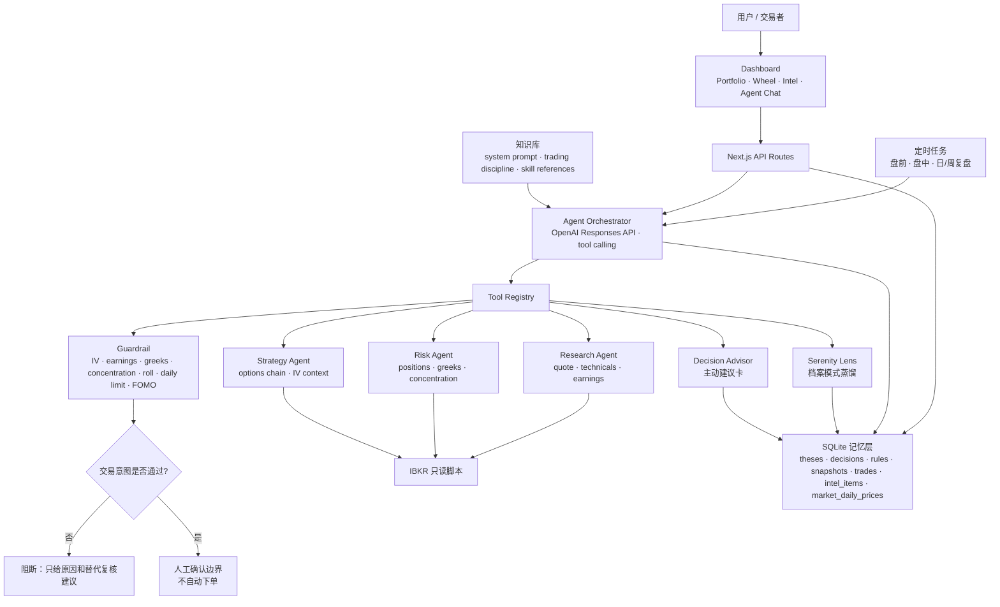
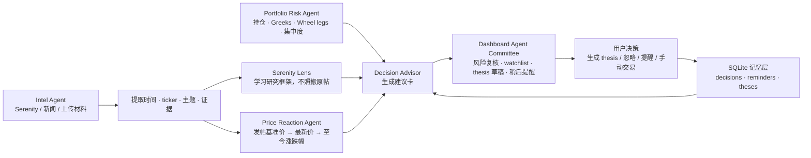
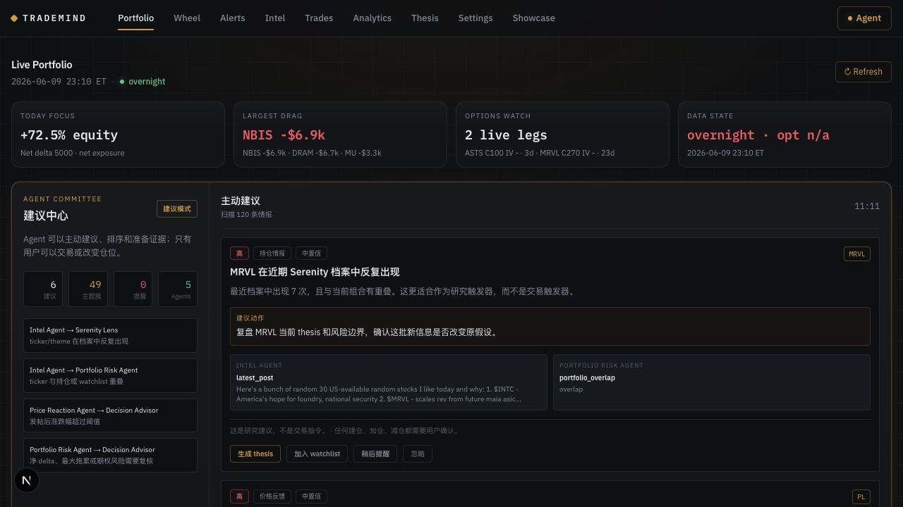
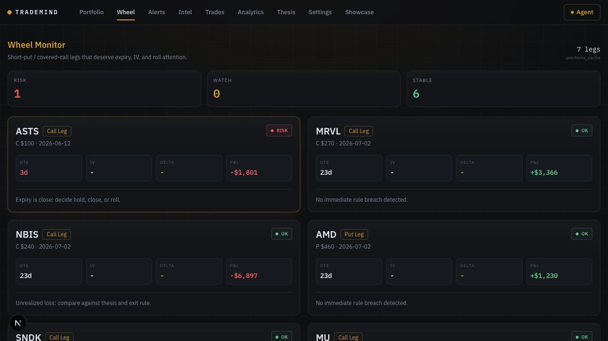
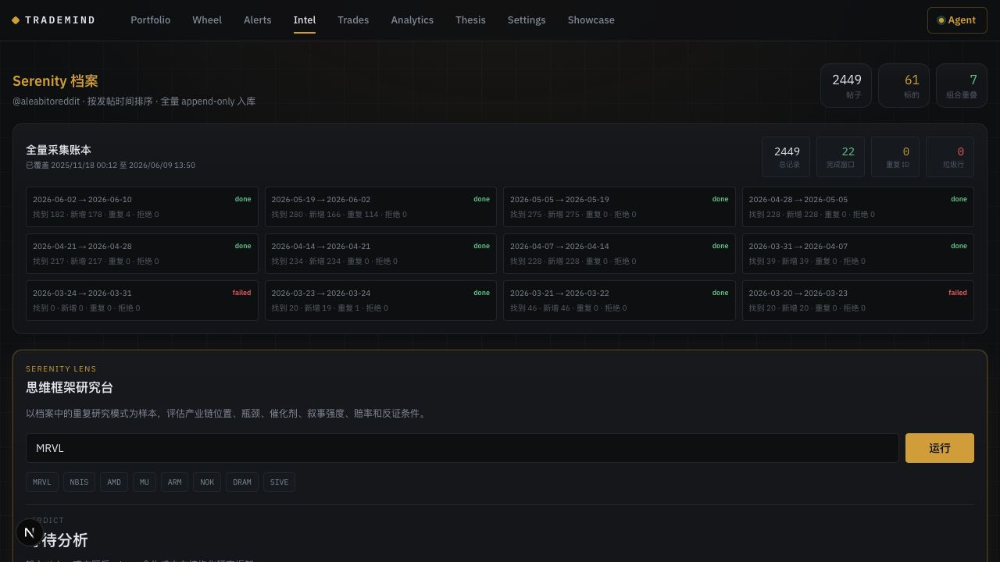
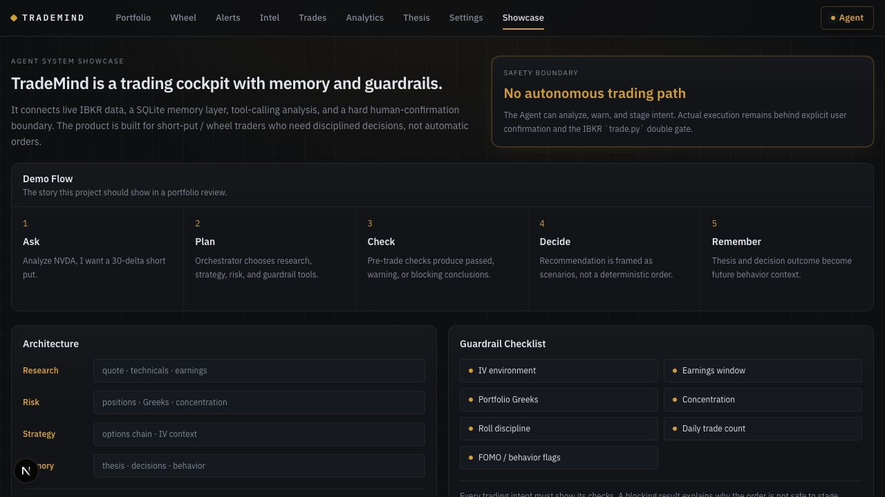

# TradeMind Agent

> 一个**有记忆、会规划、有安全门禁**的美股期权交易分析 Agent，配深色金融终端 Dashboard。
> 面向自营 **short-put / wheel** 卖方策略交易者，跑在 Interactive Brokers 之上。
>
> **TradeMind 帮你完成交易前的思考、交易中的风险确认、交易后的复盘——它不替你做买卖决定，也永不自动下单。**

---

## ⚠️ 风险提示（务必先读）

- **本项目不构成投资建议。** 所有分析、Greeks、概率均为信息参考，盈亏自负。
- **永不自动交易。** Agent 只能*建议*和*暂存待确认*订单；唯一能下单的是 IBKR skill 的 `trade.py`，需 `IBKR_TRADING_ENABLED=1` + `--confirm-trade` 双闸门，由**你本人**显式执行。先用**模拟盘**（`IBKR_PORT=4002`）验证。
- **第三方 LLM 代理 = 数据出境。** 默认 LLM 走 sssaicode 代理（OpenAI 兼容）。**Agent 对话时，你的真实持仓 / Greeks / 组合数据会被发送到该第三方服务器。** 不接受此数据流的话，请改用自托管或官方直连的 key（见[配置](#配置)）。
- **API key 自行保管。** key 存于 `.env`（已被 git 忽略、`chmod 600`），切勿提交。
- **行情订阅限制。** 无期权行情订阅时 IBKR 不下发 Greeks（Error 10091）；Dashboard 会用本地 Black-Scholes 估算并明确标注 `est`，或标 `OPT N/A`，绝不用 0 冒充。

---

## 这是什么

TradeMind 在一套**只读** IBKR 数据脚本（[`ibkr-options-assistant`](https://github.com/) skill）之上，叠加了：

| 能力 | 说明 |
|---|---|
| 🧠 **Agent 编排** | 自然语言提问 → LLM 规划调用工具（研究/风控/策略/知识库/行为）→ 综合出带正反观点和风险检查的分析 |
| 🛡️ **安全门禁 Guardrail** | 任何交易意图先过 7 项预交易检查（IV / 财报 / 组合 Greeks / 集中度 / 滚动上限 / 每日上限 / FOMO） |
| 📓 **记忆层** | SQLite 存交易假设（thesis）、决策日志、风控规则、历史快照、Flex 成交 |
| 📊 **Dashboard** | 深色金融终端 UI：实时组合 / Greeks / 市场暴露 / Wheel / Intel / 交易 / 分析 / Thesis / 设置 + 内嵌 Agent 对话面板 |
| 🧩 **Agent Committee** | 主动建议中心：组合风险、Serenity 档案、价格反馈、提醒队列协作生成“建议卡”，只建议不越权决策 |
| 📰 **Serenity 档案** | 内置 `@aleabitoreddit` Serenity 推文档案，按发帖时间展示，提取 ticker、中文解读、细分行业与发帖后涨跌幅 |
| 🔍 **Serenity Lens** | 从档案中蒸馏“思维框架”，学习研究模式而不是照搬原帖结论 |
| ⏰ **自主调度** | 盘前简报 / 盘中监控 / 日回顾 / 周回顾（cron + Telegram 推送） |

### 设计理念

- **IBKR = 现实，数据库 = 记忆。** 行情/持仓/Greeks 永远实时拉，本地只存"IBKR 不替你记的东西"。
- **脚本产出数据，模型产出判断。**
- **任何写操作（尤其下单）必经安全门禁 + 人工确认。**

---

## 架构



### Agent 协作图



---

## 快速开始

### 前置

- Python 3.11+，Node 20+
- [Interactive Brokers Gateway](https://www.interactivebrokers.com/) 运行于 `127.0.0.1:4001`（实盘）或 `4002`（模拟）
- 已安装 `ibkr-options-assistant` skill（提供 `~/Desktop/ibkr-options-assistant/scripts` 只读脚本）
- 一个 OpenAI 兼容的 LLM API key

### 1. 安装

```bash
git clone <repo> && cd TradeMind_Agent
pip install -r requirements.txt          # Python: openai
cd dashboard && npm install && cd ..      # 前端依赖
```

### 2. 配置密钥

```bash
cp .env.example .env        # 然后填入真实值
chmod 600 .env
```

`.env` 关键项：

```bash
OPENAI_API_KEY=sk-...                                   # 必填
OPENAI_BASE_URL=https://node-cf.sssaicodeapi.com/api/v1 # OpenAI 兼容端点；官方直连留空
OPENAI_MODEL=gpt-5.4                                    # 改这里即可换模型
# IBKR_SCRIPTS_DIR / TRADEMIND_DB / TELEGRAM_* 可选
```

### 3. 启动 Dashboard

```bash
cd dashboard && npm run dev
# 打开 http://localhost:3000 → 右上「🧠 Agent」开对话
```

Dashboard 会自动从 `.env` 读取 LLM key（无需额外 export）。确保 IBKR Gateway 在线以获取实时数据。

### 4.（可选）自主调度

```bash
# crontab 示例（ET 时间，注意夏令时换算）
0 13 * * 1-5  cd ~/Desktop/TradeMind_Agent && python3 -m agent.loops.premarket_brief
30 20 * * 1-5 cd ~/Desktop/TradeMind_Agent && python3 -m agent.loops.daily_review
```

---

## 使用方式

### Dashboard

| 页面 | 内容 |
|---|---|
| **Portfolio** | 实时市值 / 未实现盈亏 / 净 Delta / Theta；**Market Exposure**（多空美元敞口）；Greeks（缺数据时本地 BS 估算并标注）；逐仓位盈亏；P&L 历史；Agent Committee 主动建议卡 |
| **Wheel** | 从实时 option positions 派生 Wheel legs，按 DTE / IV / ITM / P&L 标记 OK、Watch、Risk，并复用 Portfolio 缓存快速加载 |
| **Intel** | Serenity 档案：按发帖时间排序，展示正文、中文解读、相关 ticker、细分行业、发帖基准价、最新价、至今涨跌幅；支持 HAR/JSON/TXT/截图导入 |
| **Trades** | 历史成交（Flex 导入），可按标的/类型筛选 |
| **Analytics** | 按持有期/时段的胜率、按标的的已实现盈亏 |
| **Thesis** | 交易假设日志：可新建、改状态（平仓/推翻/重开） |
| **Settings** | 在线编辑 Guardrail 风控参数；LLM 配置说明 |
| **Showcase** | 项目演示页：讲清 Agent workflow、安全边界、工具协作和记忆层 |
| **🧠 Agent** | 右侧对话面板，自然语言调用全部 Agent 能力 |

### Demo

发布演示材料放在 [`docs/demo`](docs/demo/DEMO_SCRIPT.md)。当前截图资产：

| Portfolio | Wheel |
|---|---|
|  |  |

| Serenity Intel | Showcase |
|---|---|
|  |  |

如需重新生成截图（需要 macOS 屏幕录制权限；当前仓库已包含一组通过 in-app Browser 生成的截图资产）：

```bash
scripts/capture_demo_screenshots.sh
```

如需尝试本机录屏（同样需要 macOS 屏幕录制权限）：

```bash
scripts/record_demo.sh docs/demo/trademind-demo.mp4
```

### 当前内置数据

- Serenity 档案当前内置 **2449** 条记录，覆盖 **2025-11-17 → 2026-06-09**。
- 采集记录为 append-only：手动上传、HAR/JSON/TXT 导入、浏览器采集都会入库，不覆盖旧记录。
- 历史价格缓存写入 `market_daily_prices`，当前已补齐 **2712 / 3586** 个 ticker 引用的 `baseline/current/since_pct`。
- 未补齐的多为非标准、海外或不可映射 ticker；后续可通过 symbol 映射表继续补全。
- Serenity 数据是项目内置样本；未来新增推文需要使用者自行导入或运行采集流程。

Fresh clone 后恢复内置样本库：

```bash
python3 -m agent.loops.restore_seed_db
# 如果本地已有数据库且确认要覆盖：
# python3 -m agent.loops.restore_seed_db --force
```

### Agent 对话示例

> 「分析 NVDA，我想卖一个 30 delta 的 short put」
> 「评估我当前组合的集中度和净 delta 是否偏高」
> 「TSLA 的 thesis 历史」 · 「给我今天的盘前简报」 · 「什么时候该 roll 一个 short put」

Agent 会调用实时数据 + 知识库 + 你的历史，给出带风险检查的结构化分析；涉及交易意图时强制跑 guardrail，并明确标注 `requires_confirmation`。

---

## 自定义 Agent

无需改代码，**直接编辑这些文件**：

| 改什么 | 编辑 |
|---|---|
| **Agent 人设 / 纪律 / 输出风格** | `agent/prompts/system.md`（markdown，每次运行读取） |
| **你的交易纪律知识库** | `agent/knowledge/*.md`（Agent 会检索） |
| **风控参数** | Dashboard 的 Settings 页，或 `rules` 表 |
| **可调用的工具** | `agent/tool_registry.py`（schema + handler 成对，加一个 `Tool(...)` 即可） |
| **换 LLM / 模型** | `.env` 的 `OPENAI_MODEL` / `OPENAI_BASE_URL` |

知识库来源：IBKR skill 的 `references/`（McMillan/Overby 策略、greeks、wheel 机制）+ 本地 `agent/knowledge/`（你自己的规则）。

---

## 项目结构

```
TradeMind_Agent/
├── README.md                         # 项目说明、架构图、运行方式
├── WORKLOG.md                        # 工作日志；每次实质修改追加记录
├── requirements.txt                  # Python 依赖
├── agent/
│   ├── orchestrator.py               # LLM 编排循环；Responses API + tool calling
│   ├── tool_registry.py              # 工具 schema 与 handler 的单一注册表
│   ├── guardrail.py                  # 交易意图安全门禁；关键数据不可用时 fail-closed
│   ├── tools.py                      # IBKR 脚本 runner；缓存、并发、single-flight
│   ├── journal_store.py              # SQLite 记忆层访问：thesis / decisions / intel / reminders
│   ├── serenity_archive.py           # Serenity 帖子导入、清洗、ticker 提取
│   ├── agents/
│   │   ├── research.py               # quote / technicals / earnings
│   │   ├── risk.py                   # positions / Greeks / concentration
│   │   ├── strategy.py               # options strategy context
│   │   ├── serenity_lens.py          # Serenity 档案研究框架蒸馏
│   │   └── advisor.py                # Agent Committee 主动建议卡
│   ├── loops/
│   │   ├── premarket_brief.py        # 盘前简报
│   │   ├── intraday_monitor.py       # 盘中监控
│   │   ├── daily_review.py           # 日回顾
│   │   ├── backfill_serenity_prices.py # Serenity 历史价补齐，可重复运行
│   │   └── serenity_*                # Serenity 导入、HAR replay、Lens CLI
│   ├── db/
│   │   ├── schema.sql                # SQLite schema；运行时 DB 文件不建议直接提交
│   │   └── seed/trademind_seed.sqlite # 内置 Serenity 样本库，不含交易/决策/快照
│   ├── prompts/system.md             # 可编辑 Agent system prompt
│   └── knowledge/                    # 本地交易纪律知识库
├── dashboard/
│   ├── app/
│   │   ├── page.tsx                  # Portfolio cockpit + Agent Committee
│   │   ├── wheel/page.tsx            # Wheel Monitor
│   │   ├── intel/page.tsx            # Serenity 档案、Lens、导入界面
│   │   ├── showcase/page.tsx         # Demo / portfolio review 页面
│   │   └── api/                      # Next.js API：positions、wheel、intel、advisor、chat...
│   ├── components/                   # Nav、Agent Chat、P&L history
│   └── lib/
│       ├── portfolioData.ts          # 共享 Portfolio dashboard TTL cache
│       ├── wheel.ts                  # Wheel cards 纯函数转换
│       ├── portfolioMath.ts          # Black-Scholes Greeks 估算 + market exposure
│       └── intel.ts                  # ticker 中文名称与细分行业映射
└── tests/                            # pytest；当前 109 Python tests
```

---

## 开发

```bash
python3 -m pytest -q              # Python 测试
cd dashboard && npx tsc --noEmit  # 类型检查
cd dashboard && npm run lint       # ESLint
cd dashboard && npm run build     # 生产构建
node --test --experimental-strip-types dashboard/lib/*.test.ts
```

约定：多文件改动并行执行 + 独立 reviewer 验收；改完跑测试。版本变更见 [`WORKLOG.md`](WORKLOG.md)。

### 常用维护命令

```bash
# 补齐 Serenity 发帖后的历史表现；可重复运行
python3 -m agent.loops.backfill_serenity_prices

# 只扫描前 N 条，适合验证行情源是否可用
python3 -m agent.loops.backfill_serenity_prices --limit 25

# 查看 Serenity 覆盖状态
curl -s http://localhost:3000/api/intel/collection | python3 -m json.tool
```

---

## 许可 / 免责

仅供个人研究与自用。使用本项目即表示你理解并接受上述全部[风险提示](#️-风险提示务必先读)。作者不对任何交易盈亏负责。
